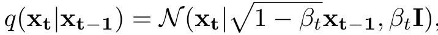
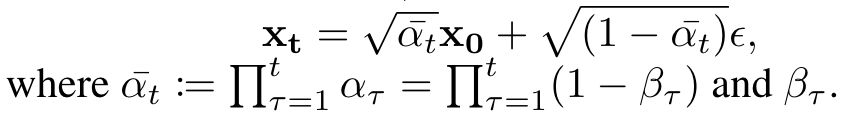
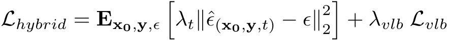
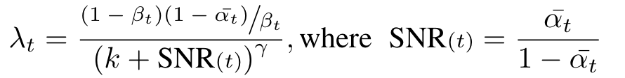

# 双光视角下无人机人群计数

> 许博雅 21302010066 ｜ 钟思祺 21302010069 ｜ 宋文彦 21302010062

## 1. 复现baseline

得到的结果为：

## 2. 最好结果

## 3. 拓展方法

我们进行了两个方向的探索，分别为图像融合和尝试更好的模型。

### 3.1 图像融合

#### 3.1.1 替换 y 分量
新的图像由红外光图的y分量与可见光图的 $Cb$，$Cr$ 分量组成。大致效果如下：

该方法的主要缺点在于过于简单，忽略了红外图像和可见光图像的细微差别。例如，红外图像主要捕获热量信息，呈现灰度图形式，对比度较低，而RGB图像则提供丰富的颜色和细节信息，直接替换Y分量值无法弥合这一差距，使融合图像看起来褪色且缺乏深度。此外，RGB图像原始的Y分量信息，通常包含重要的视觉线索，被红外数据覆盖，会导致整体图像清晰度下降，甚至会导致颜色偏离，扭曲融合图像的自然外观。

#### 3.1.2 双尺度图像融合方法

生成显著图

生成细节图

上两张图分别展示了生成显著图与细节图的过程。在图像融合过程中，分别对红外光图和可见光图进行如上操作，然后以显著图各分量的大小作为权重融合二者的细节图，再与二者等比例（0.5, 0.5）的均值滤波结果的和相加，得到最终的融合图像。

    

3.2 

### 3.3 CrowdDiff

CrowdDiff 是一个基于使用扩散模型的多假设人群密度估计工具，模型的扩散过程用于给密度图加噪，反向扩散过程用于生成密度图。

#### 3.3.1 扩散过程

样本数据 $𝑥_0$ 通过根据噪声方差调度 $𝛽_1,...,𝛽_𝑇$ 添加高斯噪声逐渐转换为噪声样本 $𝑥_𝑡$

#### 3.3.2 逆扩散过程

训练去噪扩散网络时使用了混合损失（$L_{hybrid}$）函数。为了在较低信噪比阶段促进学习粗糙特征，定义加权方案：

#### 3.3.3 模型pipeline

1. 训练过程中，使用窄核创建真实密度图。随机抽取一个时间步 $t$，根据 $t$ 时刻的方差采样高斯噪声并将其添加到真实密度图上，得到噪声图。然后将图像和 $x_t$ 输入去噪网络，训练以预测噪声。

2. 逆扩散过程中，在时间点 $T$ 采样一个高斯噪声，用于生成初始的噪声密度图 $X_𝑇$，网络将估计 $X_𝑇$中的噪声，并通过去除该噪声来生成时间 $T−1$ 时的噪声密度图 $X_{T−1}$，重复直至生成图像的密度图。使用 1,000 个时间步和 DDIM 采样，使用线性噪声调度，噪声方差范围为 $1×10^{−3}$ ～0.02。超参数 $λ_{count} = 5 × 10^{−3}$，以匹配 $L_{hybrid}$ 的值范围；$γ = 0.5$ 和 $k = 1$，用于计算基于信噪比的加权因子。模型采用原始缩放因子 $\lambda = 1×10^{−3}$，$β = 0.85$ ，最近邻搜索的最大邻居数设置为4，半径限制为图像最小维度的 0.05。
3. 去噪网络的训练初始化使用 ImageNet 预训练权重，用于超分辨率任务。网络训练进行 $2×10^5$ 次迭代，batch size为 8，图像大小为 $256×256$。使用 AdamW 优化器，学习率在 $5×10^3$ 个训练步中从 0 逐渐线性增大到 $1×10^{-4}$。

由于环境问题和测试代码的bug太多，这个模型没有得到很好的复现，有机会可以继续尝试。
