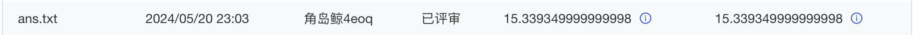
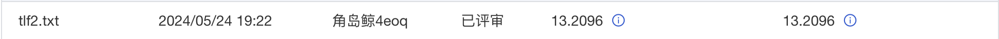
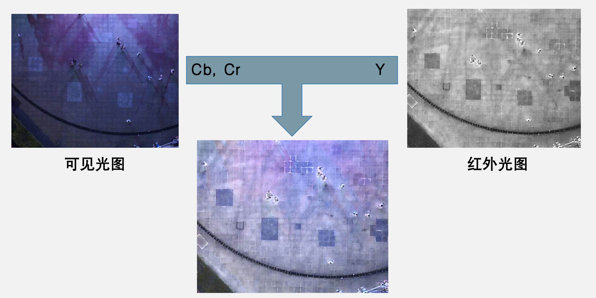
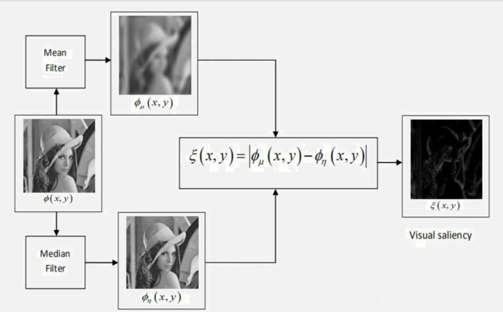
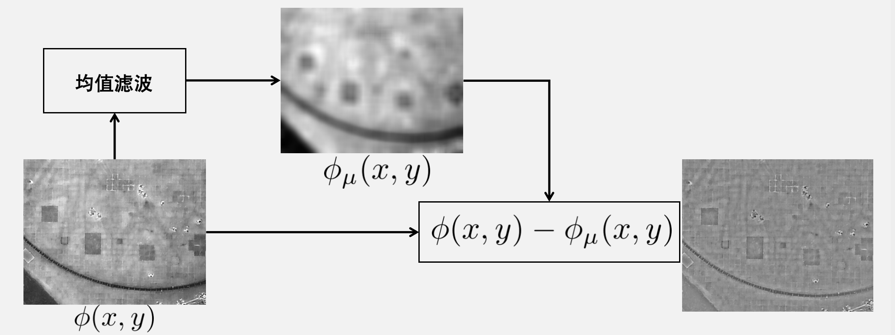
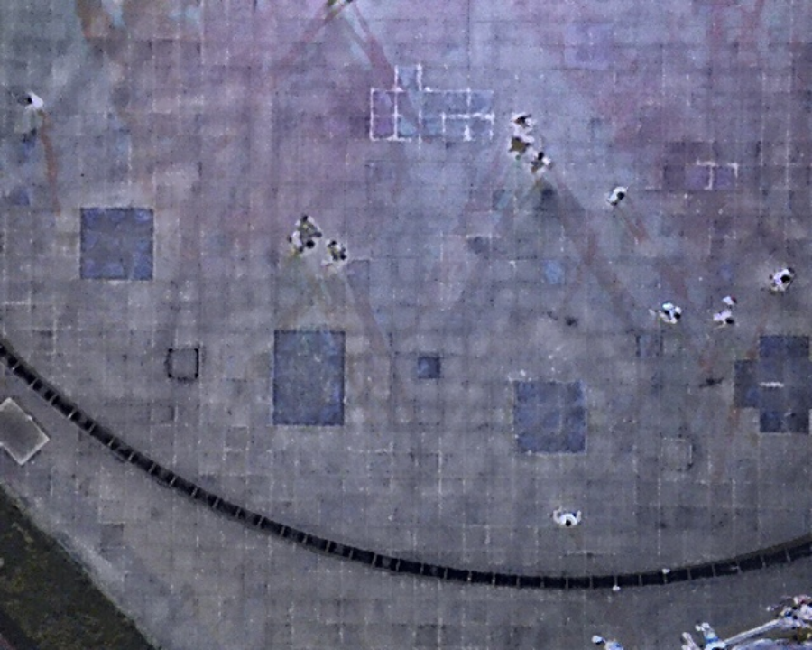
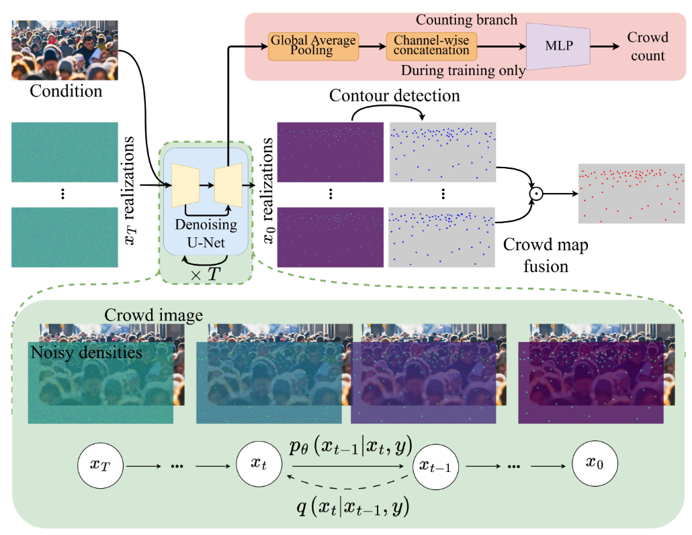

# 双光视角下无人机人群计数

> 许博雅 21302010066 ｜ 钟思祺 21302010069 ｜ 宋文彦 21302010062

## 1. 复现baseline

得到的结果为：

## 2. 最好结果

## 3. 拓展方法

我们进行了两个方向的探索，分别为图像融合和尝试更好的模型。

### 3.1 图像融合

#### 3.1.1 替换 y 分量
新的图像由红外光图的y分量与可见光图的 $Cb$，$Cr$ 分量组成。大致效果如下：

该方法的主要缺点在于过于简单，忽略了红外图像和可见光图像的细微差别。例如，红外图像主要捕获热量信息，呈现灰度图形式，对比度较低，而RGB图像则提供丰富的颜色和细节信息，直接替换Y分量值无法弥合这一差距，使融合图像看起来褪色且缺乏深度。此外，RGB图像原始的Y分量信息，通常包含重要的视觉线索，被红外数据覆盖，会导致整体图像清晰度下降，甚至会导致颜色偏离，扭曲融合图像的自然外观。

#### 3.1.2 双尺度图像融合方法

生成显著图

生成细节图

上两张图分别展示了生成显著图与细节图的过程。在图像融合过程中，分别对红外光图和可见光图进行如上操作，然后以显著图各分量的大小作为权重融合二者的细节图，再与二者等比例（0.5, 0.5）的均值滤波结果的和相加，得到最终的融合图像。

    

### 3.2 RGBT-Crowd Counting

该方法参考了论文"Cross-Modal Collaborative Representation Learning and a Large-Scale RGBT Benchmark for Crowd Counting." IEEE Conference on Computer Vision and Pattern Recognition (CVPR), 2021，并参考了相关的开源实现https://github.com/chen-judge/RGBTCrowdCounting。该研究提出结合光学和热成像信息可以极大地帮助识别行人。

#### 3.2.1 框架概述

作者提出了一个跨模态协作表示学习框架，该框架由多个模态特定分支、一个模态共享分支和一个信息聚合分发模块（IADM）组成，以充分利用不同模态的互补信息。

- **多个模态特定分支**：分别针对RGB图像和热成像图像，用于提取各自模态的特征。
- **一个模态共享分支**：旨在学习跨模态间的共享特征表示。
- **信息聚合分发模块（IADM）**：动态地在模态特定和模态共享特征之间传输信息，以增强它们的表现。

##### 1. 特征提取与信息传递

给定一个RGB图像R和一个热成像图像T，首先将它们输入到各自的分支中提取模态特定特征。模态共享分支以零张量作为输入，并逐步聚合模态特定特征的信息。IADM嵌入在不同层之后，例如Conv1_2, Conv2_2, Conv3_3, 和Conv4_3，以分层学习跨模态表示。

##### 2. 网络架构

- 框架采用CSRNet作为主干网络，该网络由VGG16的前十个卷积层作为前端块，以及六个扩张卷积层作为后端块。
- RGB和热成像图像分别输入到各自的前端块中提取特征，而模态共享分支基于CSRNet的后14个卷积层。

#### 3.2.2 数据概述

##### 1. 数据集

在上述框架中进行训练，使用了两个主要数据集：大赛提供的数据集及RGBT-CC数据集。这两个数据集结合了丰富的场景信息，具有双光信息，适合进行复杂环境下的人群计数和行为分析。

##### 2. 划分训练集和验证集

为了确保模型训练的泛化能力，我们将数据集按照8:2的比例划分为训练集和验证集。训练集用于模型的学习和调优，而验证集则用来评估模型在未见数据上的表现。这样，我们可以挑选在验证集上表现最好的模型作为我们的训练结果提交测试，以更高概率选出泛化能力强的模型，而不是过拟合的模型。

##### 3. 标签转换

为了适配深度学习模型的需要，原始数据中的XML标签格式被转换成了NumPy数组格式。这一步骤是必要的，因为它将标签转化为模型训练过程中能直接利用的形式。

##### 4. 数据增强

为了进一步提升模型对不同场景的适应能力，我们采用了随机切割的方法进行数据增强。这种方法能够通过生成模型未曾见过的训练样本，来增加数据的多样性，从而帮助模型更好地泛化到新的环境中。

### 3.3 CrowdDiff

CrowdDiff 是一个基于使用扩散模型的多假设人群密度估计工具，模型的扩散过程用于给密度图加噪，反向扩散过程用于生成密度图。

#### 3.3.1 模型pipeline

1. 训练过程中，使用窄核创建真实密度图。随机抽取一个时间步 $t$，根据 $t$ 时刻的方差采样高斯噪声并将其添加到真实密度图上，得到噪声图。然后将图像和 $x_t$ 输入去噪网络，训练以预测噪声。

2. 逆扩散过程中，在时间点 $T$ 采样一个高斯噪声，用于生成初始的噪声密度图 $X_𝑇$，网络将估计 $X_𝑇$中的噪声，并通过去除该噪声来生成时间 $T−1$ 时的噪声密度图 $X_{T−1}$，重复直至生成图像的密度图。使用 1,000 个时间步和 DDIM 采样，使用线性噪声调度，噪声方差范围为 $1×10^{−3}$ ～0.02。超参数 $λ_{count} = 5 × 10^{−3}$，以匹配 $L_{hybrid}$ 的值范围；$γ = 0.5$ 和 $k = 1$，用于计算基于信噪比的加权因子。模型采用原始缩放因子 $\lambda = 1×10^{−3}$，$β = 0.85$ ，最近邻搜索的最大邻居数设置为4，半径限制为图像最小维度的 0.05。
3. 去噪网络的训练初始化使用 ImageNet 预训练权重，用于超分辨率任务。网络训练进行 $2×10^5$ 次迭代，batch size为 8，图像大小为 $256×256$。使用 AdamW 优化器，学习率在 $5×10^3$ 个训练步中从 0 逐渐线性增大到 $1×10^{-4}$。

由于环境问题和测试代码的bug太多，这个模型没有得到很好的复现，有机会可以继续尝试。

#### 3.3.2 课堂提问

counting branch 结果没有用于预测的原因
文章中提到原因为：添加计数分支的初衷是提高众人密度图的计数性能，改工作对带有和不带有计数分支预测的去噪U-Net在不同时间步的特征图的进行了定性比较。可看出，加入计数分支，解码器从初始时间步就开始生成人群特征，预测的计数随时间变化不大，并且与真实计数显著偏离。

